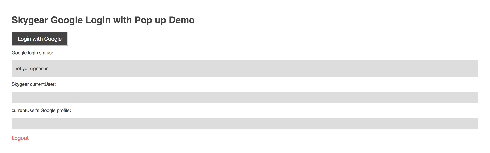

# skygear-social-login-google
A **React** app that demonstrates how to do login with the new social login api on Oursky Skygear, particularly on google.

## Tutorial
Disclaimer: this is a React absolute beginner-proof guide, bear with me if you find the elaborations too explicit, feel free to skip till places you need ;)

# Part 0: Development environment setup
0. [Install `npm`](https://www.npmjs.com/get-npm) (a very useful package manager) if you haven't

1. So that we can install skygear (the library) by running `npm install skygear` in your terminal

2. And so that we can install a React **boilerplate** called `create-react-app` by running `npm i create-react-app` in your terminal

    - A boilerplate is like an all-in-one tool make it simple to create react apps, saving the configuration and dependency hassle

We will still need to install console application later but for now we are ready to start the project!
 
3. Pick a name for your application, say `skygear-social-login-google`, which is the project name I will be using, feel free to change all occurences of this into your own `${PROJECT_NAME}`.

4. Run `create-react-app ${PROJECT_NAME}`, which in my case is `create-react-app skygear-social-login-google`

    - You can see a bunch of files generated for you in a new folder with the same project name. Pay special attention to the files `./src/index.js` the app entry point, `./src/App.js` the UI main screen, and `./src/index.css` the stylesheet

    - If you happen to be using **GitHub** to store your code, this is a good time to do that before we start. Follow the instructions on GitHub, or use the following console command sequence:
      ```
      cd ${PROJECT_NAME}      # cd skygear-social-login-google; changing into this directory
      git init
      git add .
      git commit -u "initial commit"      # or other messages
      git remote add origin git@github.com:USERNAME/REPO.git   # insert your username and your created repository name
      git push -u origin master
      ```

5. To run the web app on your local browser for coding and testing as we go, run `cd ${PROJECT_NAME}` (navigate to the newly created project folder) and then run `npm start`
6. Your default browser should show a welcome page by React by local hosting at `http://localhost:3000/`, and what you should see is a generic React page with its logo.
    - As we go on updating the project, this localhost page will respond automatically to made changes on saving those modified files. Perfect place for checking progress/debugging/sandboxing

# Part 1: Configure Skygear

1. At [Skygear](skygear.io), press `Get started` on top right corner to sign up for an account. The most important fields to fill in are

    - `Endpoint URL` (name of website or subdomain, we also call it `${APP_NAME}`)
    - `Your Email`
    - `Your Password`

In my example I called my endpoint `demo934`, so I will have a website that starts with `https://demo934.skygeario.com` later

  - To make the names less confusing, you are very welcomed to consistently set one name for all names, for example, your `${PROJECT_NAME}` for React, `Repo name` for GitHub, `${APP_NAME}` for Skygear

2. Enter Skygear and choose the App/Endpoint you just created, right on the page (`Get Started`) you should see under `Your App Configuration`, two important tokens. They help you log into Skygear when you are coding in React

    - `Server Endpoint`: my example gives simply `https://demo934.skygeario.com/`
    - `API Key`: skygear generated this for my example `c3f090ac5a954c2b82b63a1623acfee9`

Keep these two tokens around. They will come in handy when we implement the app

# Part 2: Configure Google login

The procedures are given in [this guide](https://docs.skygear.io/guides/auth/social-login/google/), follow all the steps to authorise Skygear to accessing your Google account information.

  - A reminder to help with possible troubleshooting is, in `step 5`, make sure you ticked a `Default permission` like `Email`, otherwise Google login won't work

# Part 3: Implement UI and functionalities

This is where the real programming finally takes place!

This is the layout we are trying to make here. Notice for the purpose for demo, I am keeping this app as simple and straight forward as possible.



As you can guess, it basically does two things:
  - Press `Login with Google` to perform social login. Then the login status becomes `signed in` (if error happened then `error message`), and skygear account info and google account info got displayed correctly

  - Press `Logout` to perform logout from google social login. Then the login status returns to `not yet sigend in` and the two account info textboxes got flushed again

When I introduced the project structure generated by `create-react-app`, recall that there are only 3 files inside `./src` that we will be using to use and change.

1. Let's start with `index.css`. Since UI design is not the focus of this tutorial but more of aesthetic purposes, I suggest you to copy my [stylesheet](https://github.com/bryanchun/skygear-social-login-google/blob/master/src/index.css) and overwrite your file.

    - Of course, feel free to create your own styles, but for the sake of demonstration, I will be using these defined styles and css classes as the tutorial goes, to give a reasonably good-looking UI with minimal effort

2. Next, onto the app entry point `index.js`.

    1. Import skygear for use by inserting this line:
        ``` js
        import React from 'react';
        import ReactDOM from 'react-dom';
        import './index.css';
        import skygear from 'skygear';        // << insert
        import App from './App';
        import registerServiceWorker from './registerServiceWorker';
        ```
    2. Right after the imports, punch in your Skygear `endPoint` and `apiKey` tokens from end of Part 1 of this tutorial
        ``` js
        // Set your own endPoint and apiKey here, overwrite these values
        let endPoint = 'https://demo934.skygeario.com/';
        let apiKey = 'c3f090ac5a954c2b82b63a1623acfee9';
        ```
    3. Finally, below this but before the rendering, configure the `skygear` object for later API calls by the provided `endPoint` and `apiKey`
        ``` js
        skygear.config({        // config takes both endPoint and apiKey together as an object
            endPoint,
            apiKey              // returns a promise for chaining
          }).then(value => console.info(value))       // the on-success callback function
            .catch(error => console.error(error));    // and the on-error callback function

        ReactDOM.render(<App />, document.getElementById('root'));
        registerServiceWorker();
        ```

3. Perfect. Now comes the part with most work: `App.js`.

    1. Initially you find yourself having this auto-generated layout:
        ``` js

        import React, { Component } from 'react';   // Component is in fact a member of React so the braces mean to unpack React and retrieve only React.Component
        import logo from './logo.svg';  // redundant, to be removed
        import './App.css';   // redundant, to be removed

        class App extends Component {
          render() {
            return (
              <div className="App">
                <header className="App-header">
                  
                  <h1 className="App-title">Welcome to React</h1>
                </header>
                <p className="App-intro">
                  To get started, edit <code>src/App.js</code> and save to reload.
                </p>
              </div>
            );
          }
        }
        ```

        - An explanation of what these mean: your `App` builds on top of `React.Component` which renders a `<div>` with such and such inner layouts by html as specified in method `render() { }`

        - In other words, by changing what `render` function does according to our needs, adding buttons and textfields that updates automatically, we can make the App.

    2. Let's build the skeleton of the app from changing `render` to:
        ``` js
        render() {
          return (
            <div className="Login">
              <h1>Skygear Google Login with Pop up Demo</h1>
              <button className="block-button secondary-bg" onClick={() => this.onLogin()}>Login with Google</button>

              <p>Google login status:</p>
              <div className="block-div">{this.state.status}</div>

              <p>Skygear currentUser:</p>
              <div className="block-div">{this.state.user}</div>

              <p>currentUser's Google profile:</p>
              <div className="block-div ">{this.state.profile}</div>
              <br/>
              <button className="inline-button" onClick={() => this.onLogout()}>Logout</button>
            </div>
          );
        } 
        ```

        - The `className` attribbutes appearing all over the html tags are for fitting in the defined css styles from `index.css` (ignore `App.css`)

        - `this.state.status`, `this.state.user`, `this.state.profile` are new `states` for this `App`. They behave like variables for this Component. The braces around them are React code block, everything inside them are not html markup but will be evaluated by React (javascript). Here, the string expressions will substitute the content of the tag as those constantly updating info

        - Similarly, in each `<button>`, we have attribute `onClick`. We assign a function as the value for this attribute so that whenever the button is clicked (pressed), a function that is defined with React (javascript). More on this later

    3. Now just running this code won't be enough, since those `states` and `onClick listeners` aren't defined yet, and they will bring us errors. Let's define them properly next.

        - But for a quick glimpse of the progress so far, remove all the `states` and `onClick` attributes temporarily

    4. Those 3 newly defined states go to here, in the constructor as early as `App` is created. Don't forget to perform the right imports too.
        ``` js
        import React, { Component } from 'react';
        import skygear from 'skygear';      // << insert

        class App extends Component {
          constructor(props) {
            super(props);
            this.statuses = ['not yet signed in', 'signed in', 'error message'];
            this.state = {
              status: this.statuses[0],
              user: "",
              profile: ""
            };
          }
          // other methods like render
        }
        ```

        - `constructor(props) {}` and `super(props)` are necessary function name and setups, we can take them for granted

        - `this.statuses` unsurprisingly stores the 3 and only 3 possible status for a user login, as described in the beginning of this part. It is assigned an array of strings that can be easily accessed by indexes.
          - Again this is for simplicity's sake, we definitely have better practice

        - `this.state` wraps all user-defined `states` into one object, hence we access them by `this.state.status` for example. Initialised with these 3 `states` each with a default value, we can dynamically modify these 3 `states`, so that their changes will be automatically reflected as the webpage renders again (which is quite a frequent task)
          - `this.state.status` directly uses `this.statuses[0]` defined just now, while both `this.state.user` and `this.state.profile` initialised to an empty string to represent no information present
          - `this.setState` takes an object and uses its key-value to update the old `this.state`, so with the existing `states` we can pass an anonymous object to assign a new value to that state

        - We import `skygear` again, now it is configured after going through`index.js`, ready for API calls

    5. Bravo! We are only left with the `<button>`s for login and logout to actually work as expected. These are achieved again by user-defined functions `this.onLogin` and `this.onLogout` taken as `onClick` listeners.
        ``` js
        // can be put after the constructor
        onLogin() {
          skygear.auth.loginOAuthProviderWithPopup('google').then(
            // sign in was successful
            this.doLogin,
            // sign in was unsuccessful
            error => this.setState({ status: this.statuses[2] })
          )
        }
        ```
        - `skygear.auth.loginOAuthProviderWithPopup('google')` returns a [promise](http://jamesknelson.com/grokking-es6-promises-the-four-functions-you-need-to-avoid-callback-hell/) typed object, which runs `async` (running in the background) code for you in a `synchronous` (sequential execution; normal line-by-line) situation. This may due to that this background process is asking for resource from a third-party API but still the code is not expected to wait till this to finish, but continue executing the next line.

        - What to do when that background async process is done though? That's why we have `promise.then(successCallback, FailureCallback)`. Notice in `onLogin`, if login was successful, we call `this.doLogin` (to be defined right below); else the login was unsucessful thus we instead call the error handler `error => this.setState({ status: this.statuses[2] })`, not (a must in) using the `error` provided but display the login status to be `error message`.

        - We used a few Skygear [AuthContainer APIs](https://docs.skygear.io/js/reference/latest/class/packages/skygear-core/lib/auth.js~AuthContainer.html) here, definitely check them out to understand how those methods work together. You can also find [another reference guide](https://docs.skygear.io/guides/auth/social-login/js/) on this. `skygear.auth` is the module under `skygear` that deals with authentication, you will see more of its methods being used everywhere up next.

        ``` js
        // onLogin is defined above
        doLogin(user) {
          skygear.auth.whoami().then(
            // whoami returns a Record type
            record => this.setState({ user: JSON.stringify(record.toJSON(), null, 2) }),
            error => console.error(error)
          )
          skygear.auth.getOAuthProviderProfiles().then(
            // getOAuthProviderProfiles return a JSON type
            profileJson => this.setState({ profile: JSON.stringify(profileJson, null, 2) }),
            error => console.error(error)
          )
          // status becomes signed in
          this.setState({ status: this.statuses[1] });
        }
        ```
        - We have `promise` again, this time returned from `skygear.auth.whoami()` and `skygear.auth.getOAuthProviderProfiles()`. Since whenever `doLogin` is called, login with popup on Google should be successful *already*, we can query what are the skygear account info and google account info.

        - 

        ``` js
        onLogout() {
          skygear.auth.logout().then(
            user => this.isCurrentUserNull() ?
                    console.error('Logout failure') :
                    (() => {
                      console.info('Logout success')
                      this.setState({
                        status: this.statuses[0],
                        user: "",
                        profile: ""
                        });
                    })(),
            error => console.error('Logout failure', error)
          )
        }
        ```

        ``` js
        isCurrentUserNull() {
          // as a check after skygear.auth.logout()
          skygear.auth.whoami().then(
            (values) => {return false},
            (error) => {return true}
          )
        }
        ```

# Part 4: Deploy app on Skygear

1. Configure the file `package.json`:
    - Add `'homepage': ${endPoint}/static"` field like `'homepage': https://demo934.skygeario.com/static/"`
    - Under `"scripts"` field, change the subfield `"build"` to `"build": "react-scripts build && rm -rf public_html && mv build public_html",`
    - For reference, you should have something like this:
      ``` json
      {
        "name": "skygear-social-login-google",
        "version": "0.1.0",
        "private": true,
        "homepage": "https://demo934.skygeario.com/static/",
        "dependencies": {
          "react": "^16.4.0",
          "react-dom": "^16.4.0",
          "react-scripts": "1.1.4"
        },
        "scripts": {
          "start": "react-scripts start",
          "build": "react-scripts build && rm -rf public_html && mv build public_html",
          "test": "react-scripts test --env=jsdom",
          "eject": "react-scripts eject"
        }
      }
      ```
2. So that we can finally **build** the project, i.e. export this project from React code to readily usable simpler html/css/js that is more optimised to run. On your console in your project folder, run `npm run build`

2. Next, we [deploy the built project as a static website on Skygear](https://discuss.skygear.io/t/hosting-a-static-website-with-skygear/102). Install Skygear command line interface `skycli` by running in the console `npm install -g skycli`

3. `skycli login` to login from the command line interface

4. `skycli init` to associate this project folder with one of your Skygear apps. Choose the app/endpoint you created by up/down arrow keys.

5. `skycli deploy` to host the site
    - `/public_html` is the only directory that `skycli` will upload whose content

    - Originally, `react` will make a new directory `/build` to contain the exported code, but as we modified the build script, this directory will be renamed to `/public_html`, so this modification saves the trouble to rename folders each time.

    - The file `.skyignore` lets user denote which folders/files will not be useful so that `skycli` will directly skip them. To avoid unnecessary uploads, set it to the following:
      ```
      .git            # if you have
      /node_modules
      /public
      /src
      /tutorial_res
      
      # so that only /public_html is visible to skycli
      ```

6. When deployment is done, visit `${endPoint}/static` (my example: https://demo934.skygeario.com/static/)
    - If your site doesn't update up to your latest deployment, clearing browser cookies then revisiting will help

7. Enjoy!


# Part Extra: Deploy on custom domain

If you have configurable domain names, you can host a Skygear site right on your own domain using [this guide](https://discuss.skygear.io/t/skygear-updates-custom-domain-for-static-assets-is-now-supported-on-skygear-io/130).
